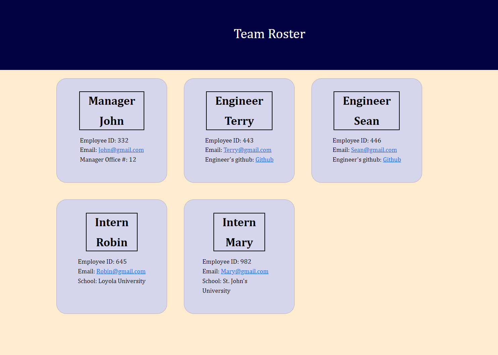

# Adam's Team Builder

## Description

The goal of this project was to design a generator for creating a Team Roster for a Tech company. The application takes in user submitted data about each employee that works at the company and provides an html document containing the finished Team Roster 
    
## Table of Contents 

* [Instructions for use](#Instructions for use)

* [Screenshot](#Screenshot)

* [Video](#Video)
    
* [Usage](#Usage)
    
* [Contributing](#Contributing)
    
* [Questions](#Questions)

## Instructions for use

In order to use this applications you will need to clone this repository. From there, run an npm install in a terminal. Then to start building your Team Roster you will type 'node index.js' in the terminal. 
    
## Screenshot

## Video

[Link to video](https://drive.google.com/file/d/1xA3tgBYEsl_qD2pIZ_aXgsk31PM1qC4c/view)
    
## Usage
    
There are no limitations for the use of this application

    
## Contibutions
    
Great thanks to my TA's and my tutor Matthew Calimbas
    

## Questions
    
If you have any comments/questions or you're interested in checking out any of my other projects, visit [My github](http://github.com/Variegatedhuman)

